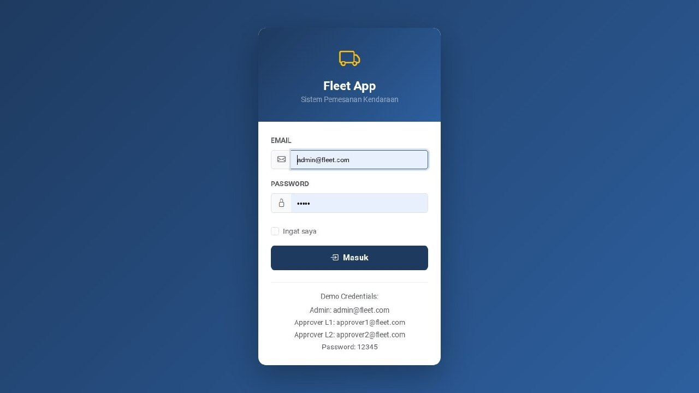

# Fleet Management - Vehicle Booking System

## Live Demo
🔗 https://web-production-da129.up.railway.app




Aplikasi pemesanan kendaraan untuk perusahaan tambang nikel dengan fitur approval berjenjang 2 level, dashboard grafik pemakaian, dan export laporan Excel.

---

## Tech Stack

| | |
|---|---|
| **Framework** | Laravel 11 |
| **PHP Version** | 8.3 |
| **Database** | MySQL 8.0 |
| **Frontend** | Blade + Bootstrap 5.3 + Chart.js 4 |
| **Excel Export** | Maatwebsite/Laravel-Excel 3.1 |

---

## Username & Password

| Role | Email | Password |
|---|---|---|
| Admin | admin@fleet.com | 12345 |
| Approver Level 1 | approver1@fleet.com | 12345 |
| Approver Level 2 | approver2@fleet.com | 12345 |

---

## Instalasi Lokal

### Prasyarat
- PHP >= 8.3
- Composer
- MySQL 8.0
- Node.js >= 20

### Langkah-langkah

```bash
# 1. Clone repo
git clone https://github.com/SZtch/vehicle-booking.git
cd vehicle-booking

# 2. Install dependencies
composer install
npm install

# 3. Setup environment
cp .env.example .env
php artisan key:generate

# 4. Edit .env, sesuaikan DB credentials
DB_DATABASE=vehicle_booking
DB_USERNAME=root
DB_PASSWORD=your_password

# 5. Buat database
mysql -u root -p -e "CREATE DATABASE vehicle_booking;"

# 6. Migrasi & seed data
php artisan migrate --seed

# 7. Build assets
npm run build

# 8. Jalankan server
php artisan serve
```

Buka `http://localhost:8000` di browser.

---

## Instalasi via GitHub Codespaces

1. Fork / clone repo ke akun GitHub kamu
2. Klik **Code → Codespaces → Create codespace on main**
3. Tunggu `postCreateCommand` selesai (sekitar 2-3 menit)
4. Port 8000 akan otomatis ter-forward dan browser terbuka
5. Jalankan `php artisan serve --host=0.0.0.0` jika belum jalan

---

## Panduan Penggunaan

### Admin

**Membuat Pemesanan:**
1. Login sebagai admin
2. Masuk ke menu **Pemesanan** → klik **Buat Pemesanan**
3. Pilih kendaraan (hanya yang tersedia yang muncul)
4. Pilih driver
5. Isi detail perjalanan: keperluan, asal, destinasi, tanggal, jumlah penumpang
6. Pilih Approver Level 1 dan Level 2
7. Klik **Buat Pemesanan**

**Melihat Status:**
- Status berubah otomatis sesuai keputusan approver
- `Pending` → `Disetujui L1` → `Disetujui` (atau `Ditolak` di tahap mana pun)

**Export Laporan:**
1. Masuk ke menu **Laporan**
2. Set filter tanggal dan status (opsional)
3. Klik **Download Laporan Excel**

### Approver

**Memproses Persetujuan:**
1. Login sebagai approver
2. Notifikasi badge merah muncul di menu **Persetujuan** jika ada yang pending
3. Klik **Proses** pada pemesanan yang ingin diproses
4. Lihat detail pemesanan
5. Isi catatan (opsional) lalu klik **Setujui** atau **Tolak**

> Note: Approver Level 2 hanya bisa memproses setelah Level 1 sudah approve.

---

## Flow Persetujuan

```
Admin buat pemesanan
        │
        ▼
  [Pending] ──────────────────────────────────┐
        │                                      │
  Approver L1 proses                    Approver L1 tolak
        │                                      │
        ▼                                      ▼
 [Disetujui L1]                          [Ditolak]
        │
  Approver L2 proses ──── tolak ────► [Ditolak]
        │
        ▼
   [Disetujui] ✓
```

---

## Database Schema

**Tables:**
- `users` - Admin dan approver dengan role & approval_level
- `vehicles` - Data kendaraan (milik & sewa)
- `drivers` - Data driver
- `bookings` - Data pemesanan dengan status tracking
- `booking_approvals` - Record persetujuan per level
- `fuel_logs` - Log konsumsi BBM per kendaraan
- `activity_logs` - Log semua aktivitas di sistem

---

## Activity Logging

Setiap aksi penting tercatat di tabel `activity_logs`:
- `created_booking` - Admin membuat pemesanan
- `approved_booking_l1` - Approver L1 menyetujui
- `approved_booking_l2` - Approver L2 menyetujui (final)
- `rejected_booking` - Approver menolak
- `cancelled_booking` - Admin membatalkan
- `exported_report` - Admin mengekspor laporan
