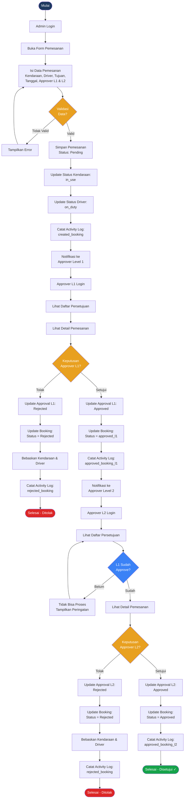

```mermaid
flowchart TD
    Start([Mulai]) --> Login[Admin Login]
    Login --> OpenForm[Buka Form Pemesanan]
    OpenForm --> FillForm[Isi Data Pemesanan\nKendaraan, Driver, Tujuan,\nTanggal, Approver L1 & L2]
    FillForm --> Validate{Validasi\nData?}
    Validate -- Tidak Valid --> ShowError[Tampilkan Error] --> FillForm
    Validate -- Valid --> SaveBooking[Simpan Pemesanan\nStatus: Pending]
    SaveBooking --> UpdateVehicle[Update Status Kendaraan:\nin_use]
    UpdateVehicle --> UpdateDriver[Update Status Driver:\non_duty]
    UpdateDriver --> LogActivity1[Catat Activity Log:\ncreated_booking]
    LogActivity1 --> NotifyL1[Notifikasi ke\nApprover Level 1]

    NotifyL1 --> L1Login[Approver L1 Login]
    L1Login --> L1ViewList[Lihat Daftar Persetujuan]
    L1ViewList --> L1ViewDetail[Lihat Detail Pemesanan]
    L1ViewDetail --> L1Decision{Keputusan\nApprover L1?}

    L1Decision -- Tolak --> L1Reject[Update Approval L1:\nRejected]
    L1Reject --> UpdateBookingRejected1[Update Booking:\nStatus = Rejected]
    UpdateBookingRejected1 --> FreeVehicle1[Bebaskan Kendaraan & Driver]
    FreeVehicle1 --> LogReject1[Catat Activity Log:\nrejected_booking]
    LogReject1 --> EndRejected1([Selesai - Ditolak])

    L1Decision -- Setujui --> L1Approve[Update Approval L1:\nApproved]
    L1Approve --> UpdateBookingL1[Update Booking:\nStatus = approved_l1]
    UpdateBookingL1 --> LogActivity2[Catat Activity Log:\napproved_booking_l1]
    LogActivity2 --> NotifyL2[Notifikasi ke\nApprover Level 2]

    NotifyL2 --> L2Login[Approver L2 Login]
    L2Login --> L2ViewList[Lihat Daftar Persetujuan]
    L2ViewList --> CheckL1{L1 Sudah\nApprove?}
    CheckL1 -- Belum --> L2Wait[Tidak Bisa Proses\nTampilkan Peringatan] --> L2ViewList
    CheckL1 -- Sudah --> L2ViewDetail[Lihat Detail Pemesanan]
    L2ViewDetail --> L2Decision{Keputusan\nApprover L2?}

    L2Decision -- Tolak --> L2Reject[Update Approval L2:\nRejected]
    L2Reject --> UpdateBookingRejected2[Update Booking:\nStatus = Rejected]
    UpdateBookingRejected2 --> FreeVehicle2[Bebaskan Kendaraan & Driver]
    FreeVehicle2 --> LogReject2[Catat Activity Log:\nrejected_booking]
    LogReject2 --> EndRejected2([Selesai - Ditolak])

    L2Decision -- Setujui --> L2Approve[Update Approval L2:\nApproved]
    L2Approve --> UpdateBookingApproved[Update Booking:\nStatus = Approved]
    UpdateBookingApproved --> LogActivity3[Catat Activity Log:\napproved_booking_l2]
    LogActivity3 --> EndApproved([Selesai - Disetujui ✓])

    style Start fill:#1e3a5f,color:#fff
    style EndApproved fill:#16a34a,color:#fff
    style EndRejected1 fill:#dc2626,color:#fff
    style EndRejected2 fill:#dc2626,color:#fff
    style L1Decision fill:#e8a020,color:#fff
    style L2Decision fill:#e8a020,color:#fff
    style Validate fill:#e8a020,color:#fff
    style CheckL1 fill:#3b82f6,color:#fff
```
