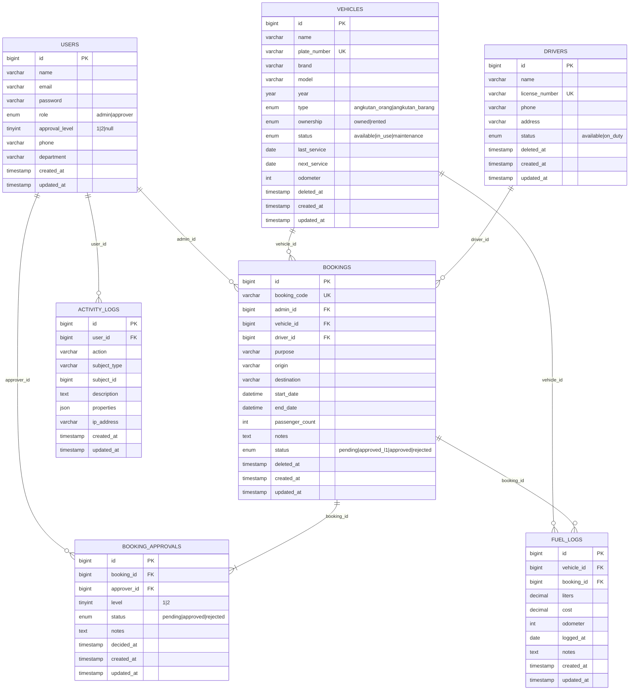

```mermaid
erDiagram
    USERS {
        bigint id PK
        varchar name
        varchar email
        varchar password
        enum role "admin|approver"
        tinyint approval_level "1|2|null"
        varchar phone
        varchar department
        timestamp created_at
        timestamp updated_at
    }

    VEHICLES {
        bigint id PK
        varchar name
        varchar plate_number UK
        varchar brand
        varchar model
        year year
        enum type "angkutan_orang|angkutan_barang"
        enum ownership "owned|rented"
        enum status "available|in_use|maintenance"
        date last_service
        date next_service
        int odometer
        timestamp deleted_at
        timestamp created_at
        timestamp updated_at
    }

    DRIVERS {
        bigint id PK
        varchar name
        varchar license_number UK
        varchar phone
        varchar address
        enum status "available|on_duty"
        timestamp deleted_at
        timestamp created_at
        timestamp updated_at
    }

    BOOKINGS {
        bigint id PK
        varchar booking_code UK
        bigint admin_id FK
        bigint vehicle_id FK
        bigint driver_id FK
        varchar purpose
        varchar origin
        varchar destination
        datetime start_date
        datetime end_date
        int passenger_count
        text notes
        enum status "pending|approved_l1|approved|rejected"
        timestamp deleted_at
        timestamp created_at
        timestamp updated_at
    }

    BOOKING_APPROVALS {
        bigint id PK
        bigint booking_id FK
        bigint approver_id FK
        tinyint level "1|2"
        enum status "pending|approved|rejected"
        text notes
        timestamp decided_at
        timestamp created_at
        timestamp updated_at
    }

    FUEL_LOGS {
        bigint id PK
        bigint vehicle_id FK
        bigint booking_id FK
        decimal liters
        decimal cost
        int odometer
        date logged_at
        text notes
        timestamp created_at
        timestamp updated_at
    }

    ACTIVITY_LOGS {
        bigint id PK
        bigint user_id FK
        varchar action
        varchar subject_type
        bigint subject_id
        text description
        json properties
        varchar ip_address
        timestamp created_at
        timestamp updated_at
    }

    USERS ||--o{ BOOKINGS : "admin_id"
    USERS ||--o{ BOOKING_APPROVALS : "approver_id"
    USERS ||--o{ ACTIVITY_LOGS : "user_id"
    VEHICLES ||--o{ BOOKINGS : "vehicle_id"
    VEHICLES ||--o{ FUEL_LOGS : "vehicle_id"
    DRIVERS ||--o{ BOOKINGS : "driver_id"
    BOOKINGS ||--|{ BOOKING_APPROVALS : "booking_id"
    BOOKINGS ||--o{ FUEL_LOGS : "booking_id"
```
